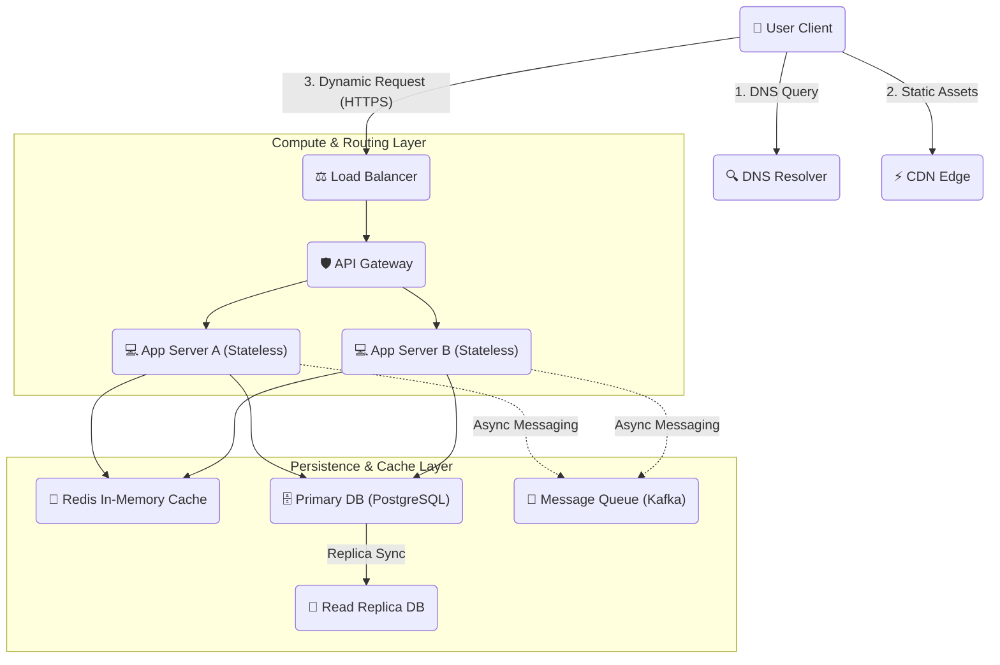

# 🖥️ The Simple System Design Showcase

Welcome to the **System Design Showcase**! This repository is a simple, highly visual guide to how large websites and applications are built. 

We explain how big systems handle millions of users, keep databases safe, stay incredibly fast, and remain online 24/7. We use plain English, everyday examples, and clear diagrams to make complex engineering topics easy for anyone to learn!

---

## 🗺️ How a Big Website Works (A Simple Map)

Below is a bird's-eye view of how a modern website works under the hood. It shows how a user's request travels through security, load balancers, web servers, caches, and databases:

---

## 🗂️ Explore the Learning Modules

Check out the detailed guides inside our **[Basics Directory](./basics/)**:

### 📦 [1. Scaling & Network Basics](./basics/01_scalability_network.md)
*How to grow your website and send data safely.*
- Vertical vs. Horizontal Scaling (Buying a bigger computer vs. adding more computers)
- Load Balancers (Splitting traffic evenly so servers don't crash)
- Network Protocols (Rules that let computers talk, like TCP, UDP, and HTTP)

### 🗄️ [2. Databases & Caching Basics](./basics/02_databases_caching.md)
*How we save information and make it load instantly.*
- CAP & PACELC Theorems (How databases handle network errors and speed trade-offs)
- SQL vs. NoSQL (Excel-style tables vs. flexible document files)
- Caching (Saving popular data in super-fast RAM)
- Database Scaling (Using read backups and sharding tables)

### 🛡️ [3. Reliability & APIs Basics](./basics/03_reliability_apis.md)
*How computers talk safely and handle errors.*
- API Styles (REST, gRPC, GraphQL, and WebSockets)
- Idempotency Keys (How to make sure users are never charged twice by mistake)
- Stateless Services (Designing servers so they are super easy to scale)
- Rate Limiting & Circuit Breakers (Protecting your system from crashes)

### ⚖️ [4. System Speed & Uptime](./basics/04_system_characteristics.md)
*How to keep your website fast and always online.*
- Latency vs. Throughput (Speed per request vs. total amount of requests)
- High Availability (Active-Active backups and server heartbeats)
- Asynchronous Processing (Using Message Queues to do heavy work in the background)
- Hot vs. Cold Storage (Using fast SSDs for popular data and cheap tape vaults for backups)

### 🎯 [5. The System Design Interview Blueprint](./basics/05_interview_steps.md)
*A simple, step-by-step playbook to ace your system design interviews.*
- Clarifying requirements and picking core features
- Quick scale estimations (math calculations)
- Drawing high-level architecture maps
- Reviewing your design and fixing mistakes on the fly
