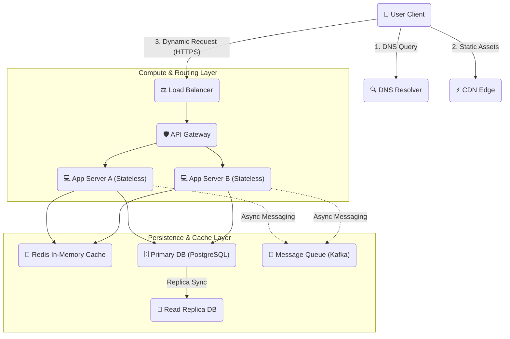

# 🖥️ The Ultimate System Design Showcase

Welcome to the **System Design Showcase**! This repository is a highly visual, comprehensive, and production-ready encyclopedia of distributed systems architecture, design patterns, and engineering trade-offs.

This showcase is engineered to help software developers, systems architects, and technical leaders master the design of highly scalable, available, reliable, and performant systems.

---

## 🗺️ Architectural Roadmap & Showcase Tour

Below is a bird's-eye view of how a modern, production-grade distributed system operates. This map illustrates how clients request resources and how data flows through various layers of security, routing, compute, caching, and persistence:

---

## 🗂️ Showcase Learning Directory

Start your distributed systems journey by exploring the dedicated core modules inside our **[Basics Directory](./basics/)**:

### 📦 [1. Scalability & Network Basics](./basics/01_scalability_network.md)
*Master compute scaling and how packages move across the wire.*
- Horizontal vs. Vertical Scaling (Detailed Trade-offs Matrix)
- Load Balancers (L4 vs. L7, Routing Algorithms)
- Essential Network Protocols (TCP, UDP, HTTP, WebSockets)

### 🗄️ [2. Databases & Caching Basics](./basics/02_databases_caching.md)
*Understand distributed consistency guarantees and sub-millisecond data retrieval.*
- The CAP & PACELC Theorems (MongoDB vs. Cassandra trade-offs)
- Consistency Models (Strong vs. Eventual consistency)
- SQL vs. NoSQL Databases (ACID vs. BASE)
- Advanced Caching Strategies (Cache-Aside, Write-Through, Write-Back)
- Database Scaling (Replication, Read Replicas, Table Sharding)

### 🛡️ [3. Reliability & APIs Basics](./basics/03_reliability_apis.md)
*Design robust APIs and build fault-tolerant microservice communications.*
- API Architectural Styles (REST, gRPC, GraphQL, WebSockets)
- Request Idempotency Key Architecture
- Stateless vs. Stateful Service designs
- Rate Limiting Algorithms (Token Bucket, Leaky Bucket, Sliding Window)
- Resilience Patterns (Circuit Breaker state engine, Backoffs & Jitter)

### ⚖️ [4. System Characteristics & Performance Metrics](./basics/04_system_characteristics.md)
*Configure systems to balance latency, throughput, and high availability targets.*
- Latency vs. Throughput (Definitions & Measurement trade-offs)
- High Availability (Uptime "Nines" matrix, GeoDNS, Active/Passive failovers)
- Asynchronous Processing (Decoupled Message Queues like Kafka/RabbitMQ)
- Low-Latency Tools (CDNs, Edge compute, HTTP/3 QUIC connection multiplexing)
- Tiered Storage Strategies (Hot SSDs vs. Cold S3 Glacier)

### 🎯 [5. The System Design Interview Blueprint](./basics/05_interview_steps.md)
*An interactive, collaborative playbook for technical interviews.*
- Clarifying requirements (Functional vs. Non-Functional scopes)
- Back-of-the-envelope scale calculations (QPS, storage, memory approximations)
- Creating and explaining high-level designs
- Refining component deep-dives and handling sharding hotspot mistakes
