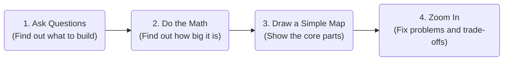
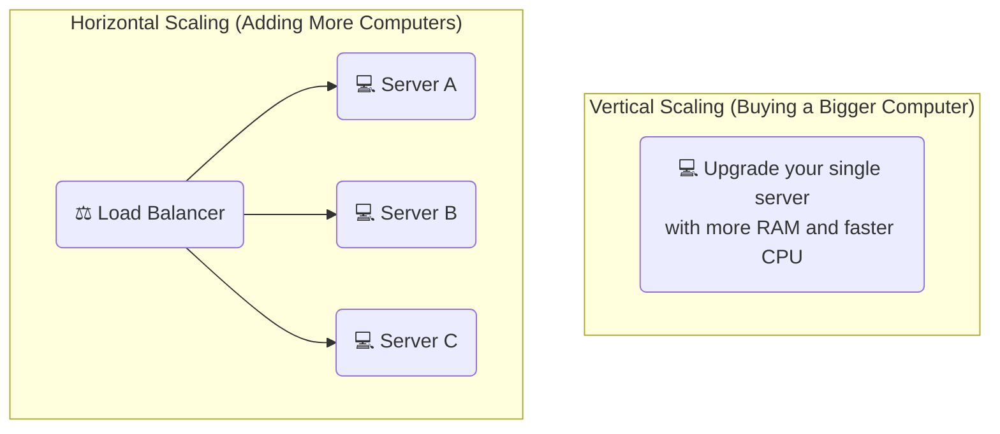

# 🚀 Part 1: Scaling & Network Basics

In this guide, we will learn how to make a website bigger (scaling) and how computers talk to each other over the internet (networking).

---

## 📋 1. How to Design a System (The 4-Step Plan)

When a company asks you to design a system, don't just start coding. Instead, follow this simple 4-step plan:

### Doing Simple Math
Before building, you need to estimate how much traffic your site will get. 

*   **Easy Numbers to Remember:**
    *   **If you have 1 Million daily users**:
        *   Your site will get about **12 requests every second** on average.
        *   At busy times (peak hours), it might jump to **24 or 60 requests every second**.
    *   **Saving Data**:
        *   If 1 user writes a small 1 KB text message, that takes almost no space.
        *   But if **100 Million users** write that message every day, you will need **100 Gigabytes (GB)** of storage every single day!

---

## ⚖️ 2. Growing Your Website (Vertical vs. Horizontal)

When too many people use your website, your server gets slow. You have two ways to fix this:

### Which one is better?

| Feature | Vertical (Make one computer bigger) | Horizontal (Add more computers) |
| :--- | :--- | :--- |
| **What you do** | Buy a more expensive, faster computer. | Connect lots of cheap, normal computers together. |
| **What if it breaks?** | If that one computer breaks, your site goes down. | If one computer breaks, the others keep working! |
| **Is there a limit?** | Yes. You can only buy a computer so big. | No limit. You can keep adding computers forever. |
| **Is it hard to code?** | Very easy. No code changes needed. | Harder. You need a way to split the work between computers. |
| **Cost** | Gets super expensive very quickly. | Cheap and grows steadily. |

---

## 🚦 3. Load Balancers (The Traffic Cop)

A **Load Balancer** is like a traffic cop. When users visit your site, the Load Balancer takes their requests and splits them evenly among all your servers so no single computer gets overwhelmed.

### Two Ways to Route Traffic (Layer 4 vs. Layer 7)
*   **Layer 4 (Fast and Simple):** The traffic cop only looks at the package's address (IP and Port) and forwards it immediately. It's super fast, but it can't look inside the package.
*   **Layer 7 (Smart and Detailed):** The traffic cop opens the package and looks inside (at the URL path, cookies, or headers). For example, it sends video requests to a video server, and text requests to a text server. It's smarter but takes a little more time.

### Simple Routing Rules
1.  **Round Robin:** Hand out requests in a circle (Server 1, Server 2, Server 3, then back to Server 1).
2.  **Least Connections:** Send the next request to the server that is currently doing the least amount of work.
3.  **IP Hash:** Remember the user's internet address. Always send that same user to the same server so their login session doesn't get lost.

---

## 📡 4. Network Protocols (How Computers Talk)

Computers need rules to talk to each other. These rules are called **Protocols**.

### The Most Common Protocols

| Protocol | What it does | Best Use Case |
| :--- | :--- | :--- |
| **TCP** | Super safe and reliable. It checks if every packet got there safely and in the right order. | Webpages, emails, and database connections. |
| **UDP** | Super fast but doesn't check for mistakes. It just throws packets and hopes they arrive. | Live video streams, online gaming, and voice calls. |
| **HTTP/HTTPS** | A simple question-and-answer rule. The phone asks for a page, and the server sends it. | Standard web browsing and APIs. |
| **WebSockets** | Keeps a constant, two-way line open between the phone and the server. | Live chat apps and sports scoreboards. |

---

### Next Module:
👉 [**Part 2: Databases & Caching Basics**](./02_databases_caching.md)
