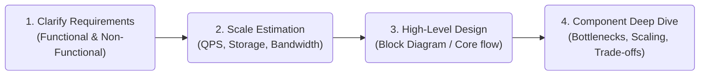
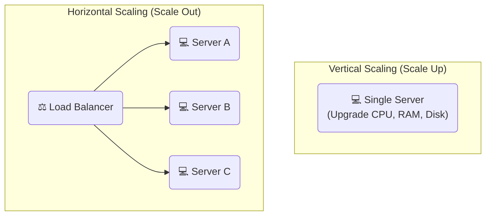

# 🚀 Module 01: Scalability & Network Basics

This module covers the core system design interview framework, estimation methods, how to scale computing infrastructure, and how data moves across the network.

---

## 📋 1. The System Design Framework

When designing any production-grade system, jumping straight into coding or detailing specific database tables leads to structural failures. Architects follow a structured four-stage process:

### Back-of-the-Envelope Scale Calculations
Before selecting technology, perform high-level resource estimations.

*   **Key Approximations:**
    *   **1 Million Daily Active Users (DAU)**:
        *   Average Request Rate (QPS) = $1,000,000 / 86,400 \text{ seconds} \approx 12 \text{ QPS}$.
        *   Peak QPS = $\text{Average QPS} \times 2 \approx 24 \text{ QPS}$ (conservative) or $\times 5 \approx 60 \text{ QPS}$ (high peak traffic).
    *   **Data Estimation**:
        *   1 Character = 1 Byte (ASCII), 2-4 Bytes (UTF-8).
        *   1 write/second of 1 KB payload = $86.4 \text{ MB/day}$.
        *   100 Million writes/day of 1 KB payload = $100 \text{ GB/day}$.

---

## ⚖️ 2. Vertical vs. Horizontal Scaling

To handle increasing traffic or data volume, systems must scale.

### Comparison Matrix

| Attribute | Vertical Scaling (Scale Up) | Horizontal Scaling (Scale Out) |
| :--- | :--- | :--- |
| **Action** | Add resources (CPU, RAM) to an existing machine | Add more machines to the network |
| **Single Point of Failure** | Yes (If the machine goes down, the entire system is down) | No (Built-in redundancy, high availability) |
| **Limit** | Hard hardware limits (Max RAM/sockets per board) | Practically limitless (scale linearly by adding nodes) |
| **Complexity** | Extremely simple (no code changes needed) | Higher (requires load balancer, shared state management) |
| **Cost Profile** | Exponentially expensive for top-tier hardware | Linear cost scaling with standard hardware |

---

## 🚦 3. Load Balancers (LBs)

Load Balancers act as traffic cops, distributing client requests across servers to prevent single-instance overload and single points of failure.

### Layer 4 vs. Layer 7 Load Balancing
*   **Layer 4 (Transport Layer):**
    *   Routing is based purely on network IP and TCP/UDP port info.
    *   *Pros:* Extremely fast, highly performant (no deep packet inspection).
    *   *Cons:* Cannot inspect application data; cannot route based on request headers, cookies, or path.
*   **Layer 7 (Application Layer):**
    *   Routing is based on HTTP request contents (URL paths, headers, cookies).
    *   *Pros:* Intelligent routing (e.g., `/api` goes to API cluster, `/static` goes to CDN/S3).
    *   *Cons:* More resource-intensive (performs SSL decryption and deep packet inspection).

### Common Load Balancing Algorithms
1.  **Round Robin:** Distributes requests sequentially. Simple but assumes all servers have equal capacity.
2.  **Least Connections:** Directs traffic to the server with the active minimum concurrent connections. Ideal for long-running connections.
3.  **IP Hash:** Hashes the client's IP to assign a server. Ensures a client maintains session affinity (sticky sessions) with a specific server.

---

## 📡 4. Network Protocols

Understanding how data travels between client and server is key to designing high-performance systems.

### Protocols at a Glance

| Protocol | OSI Layer | Key Characteristic | Ideal Use Case |
| :--- | :--- | :--- | :--- |
| **TCP** | L4 (Transport) | Connection-oriented, guarantees packet delivery, ordered, flow control | Webpages, file transfers, database connections |
| **UDP** | L4 (Transport) | Connectionless, fire-and-forget, fast, no delivery guarantees | Live video streaming, gaming, VoIP |
| **HTTP/HTTPS** | L7 (Application) | Request-Response cycle, stateless, secure over TLS | Standard REST APIs, web browsing |
| **WebSockets** | L7 (Application) | Bidirectional, persistent, single TCP socket connection | Chat apps, live dashboards, real-time gaming |

---

### Next Module:
👉 [**Module 02: Databases & Caching Basics**](./02_databases_caching.md)
