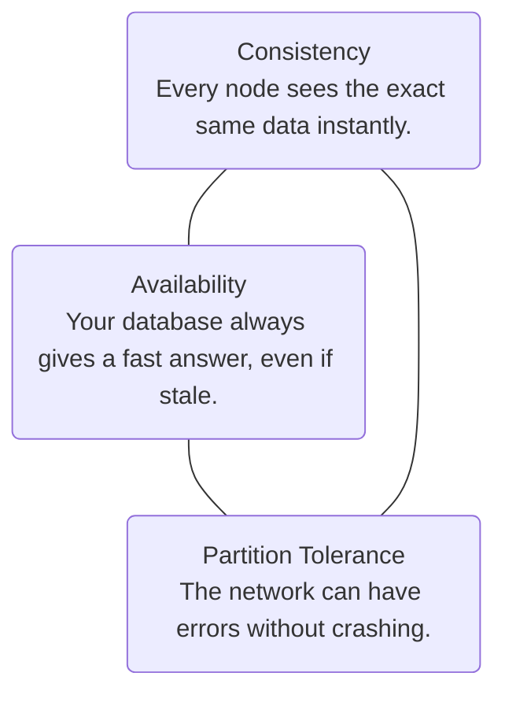
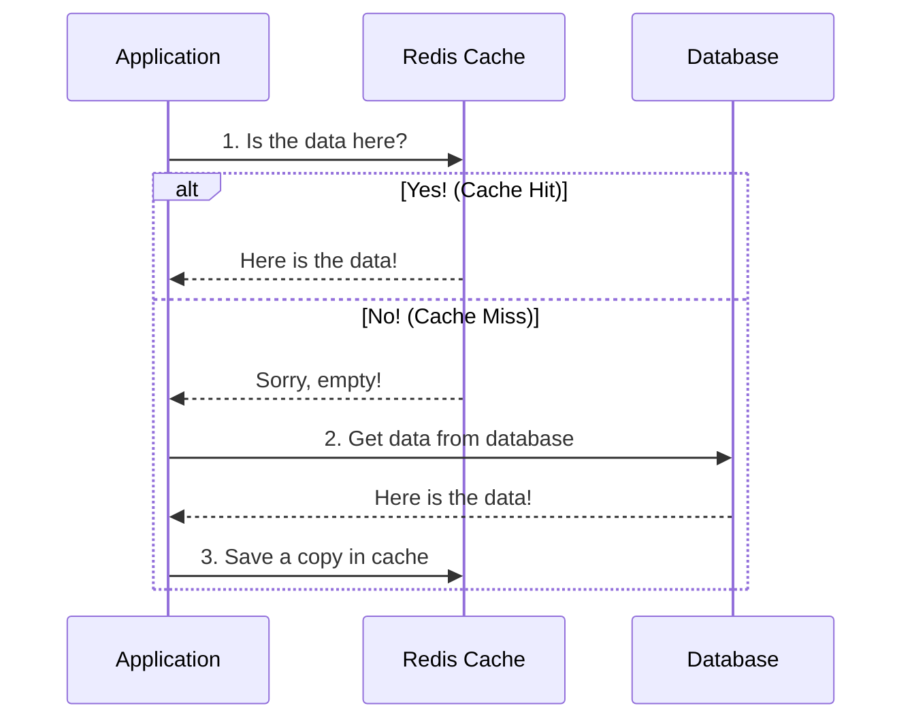
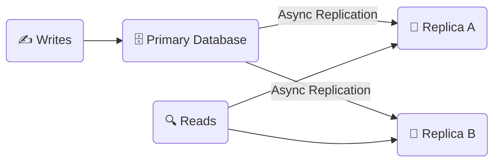

# 🗄️ Part 2: Databases & Caching Basics

In this guide, we will learn how systems save information, how we keep data consistent across many computers, and how we make things load instantly using caching.

---

## 🏛️ 1. The Rules of Distributed Databases

When you save data on just one computer, it is simple. But when you have a giant website with databases all over the world, you have to follow some strict rules.

### The CAP Theorem (Choose Two)
This rule says that when your computers are spread out, and the network breaks (a **Partition**), you can only choose **one** of these two options:

> [!IMPORTANT]
> **The Real Choice:** Networks *will* have errors eventually. So Partition Tolerance (P) is mandatory. When that happens, you must choose:
> - **CP (Consistency):** Lock the database and stop answering requests until the network is fixed. (Choose this if you are a bank—you can never show the wrong money balance!).
> - **AP (Availability):** Keep answering requests, even if some servers show slightly old data. (Choose this for social media likes—it is okay if a friend sees 99 likes instead of 100 for a few seconds).

### The PACELC Theorem (The Everyday Choice)
This rule goes further. It asks: *"What do we do when the network is working perfectly fine?"*
> **If there is a Partition (P), choose Availability (A) or Consistency (C); Else (E), choose Latency (L) or Consistency (C).**

*   **Latency (Speed) preference:** Some systems prefer to be super fast (L), even if it means showing slightly old data for a split second (e.g., Cassandra).
*   **Consistency preference:** Other systems prefer to make you wait a tiny bit to guarantee the data is 100% correct (e.g., MongoDB).

---

## 📊 2. SQL vs. NoSQL (How to Store Data)

There are two main ways to store information:

| Feature | SQL (Relational Databases) | NoSQL (Non-Relational) |
| :--- | :--- | :--- |
| **How it looks** | Like Excel spreadsheets with rows, columns, and strict tables. | Flexible files, lists, key-value pairs, or graphs. |
| **Scaling** | Hard to split across multiple computers. | Easy to split across many computers. |
| **Rule style** | Perfect safety (ACID). Every transaction is guaranteed to work cleanly. | High speed and basic availability (BASE). |
| **Examples** | PostgreSQL, MySQL, SQLite | MongoDB, Cassandra, Redis |

---

## ⚡ 3. Caching (Making Data Load Instantly)

A **Cache** is a super-fast, in-memory storage drawer (like Redis). Instead of making a slow trip to the database on the hard drive, we keep popular data in the cache (RAM) so it loads in a millisecond.

### Cache-Aside (Lazy Loading)
This is the most common way to cache:
1.  Check the cache first.
2.  If the data is there (Cache Hit), return it instantly.
3.  If not (Cache Miss), read it from the database, save a copy in the cache for next time, and return it.

### Write-Through (Write to Both)
Save data to the cache and the database at the exact same time. The cache is never old, but saving data is slightly slower.

### Write-Back (Write to Cache First)
Write data directly to the fast cache and say "Done!" to the user immediately. Later, the cache slowly syncs the data to the database in the background. It is super fast, but if the cache crashes before syncing, you could lose data.

---

## 📈 4. Scaling Your Database

When your database gets too busy, you can use these tricks to share the workload:

1.  **Read Replicas (Leader-Follower):** You have one "Primary" database for writing data. That primary database automatically copies the updates to "Replica" databases. All users read from the replicas. This makes reading data super fast!
2.  **Sharding:** Splitting a giant database table into smaller pieces (shards) and putting them on different computers. For example, users with IDs 1-1000 go to Server 1, and 1001-2000 go to Server 2.

---

### Next Module:
👉 [**Part 3: Reliability & APIs Basics**](./03_reliability_apis.md)
