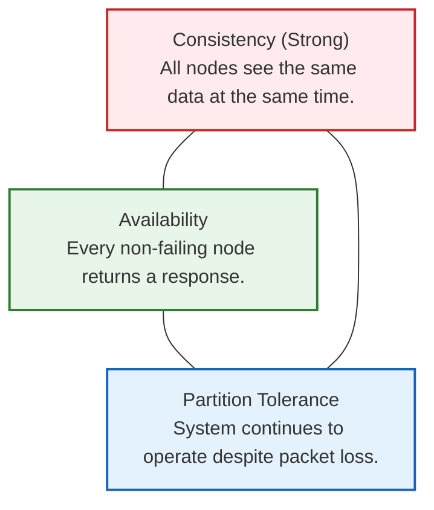
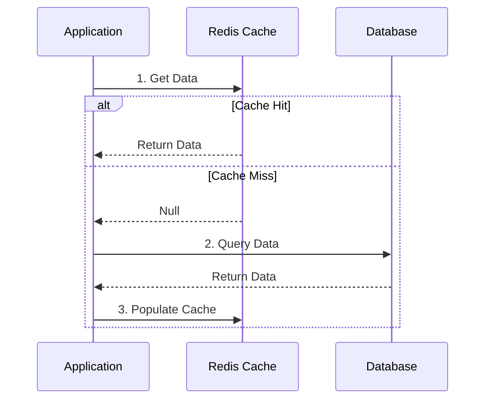
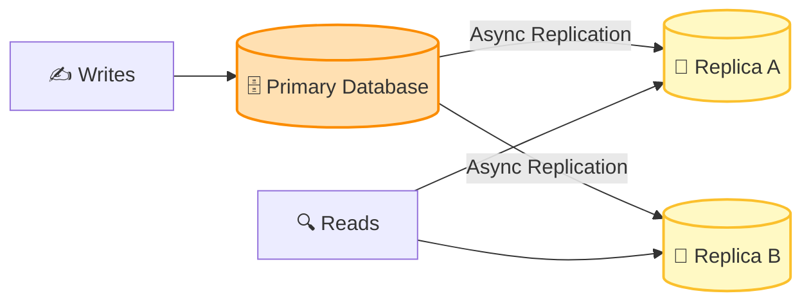

# 🗄️ Module 02: Databases & Caching Basics

This module covers the core concepts of data persistence, distributed systems guarantees (CAP/PACELC), caching strategies to reduce database load, and techniques to scale data layers for extreme low latency.

---

## 🏛️ 1. Distributed Database Theorems

In a single-instance database, ACID transactions ensure consistency. In a distributed environment with multiple database nodes, we must navigate the laws of distributed systems.

### The CAP Theorem
The CAP Theorem states that a distributed data store can simultaneously provide at most two of the following three guarantees:

> [!IMPORTANT]
> **The Real Choice:** Networks are inherently unreliable, so **Partition Tolerance (P) is mandatory**. Therefore, when a network partition occurs, a system must choose between:
> - **CP (Consistency / Partition Tolerance):** Block the request to ensure data correctness across all nodes (sacrificing availability).
> - **AP (Availability / Partition Tolerance):** Return a response using the locally available data, even if it is stale (sacrificing strong consistency).

### The PACELC Theorem
An extension of the CAP Theorem, PACELC addresses what happens during *normal operation* (when there are no partitions):

> **If there is a Partition (P), choose Availability (A) or Consistency (C); Else (E), choose Latency (L) or Consistency (C).**

| System | Partition Behavior | Normal Behavior | Ideal Use Case |
| :--- | :--- | :--- | :--- |
| **MongoDB** | CP | EC (Prefers Consistency over Latency) | Financial records, Inventory management |
| **Cassandra** | AP | EL (Prefers Latency over Consistency) | User activity logs, high-throughput writes |

---

## 🔄 2. Consistency Models

1.  **Strong Consistency:** Once a write is complete, any subsequent read will return that value immediately (e.g., PostgreSQL primary).
2.  **Eventual Consistency:** Write updates are asynchronously replicated. Reads may return stale data temporarily, but all nodes will eventually converge on the correct value (e.g., Cassandra).

---

## 📊 3. SQL vs. NoSQL

Distributed systems select database architectures based on structural and transactional requirements.

| Characteristic | SQL (Relational) | NoSQL (Non-Relational) |
| :--- | :--- | :--- |
| **Data Model** | Tables with predefined schema & relations | Key-Value, Document, Wide-Column, Graph |
| **Scaling** | Primarily Vertical (Horizontal via sharding is complex) | Horizontal by design (automatically partitions data) |
| **Transactions** | ACID (Atomicity, Consistency, Isolation, Durability) | BASE (Basically Available, Soft state, Eventual consistency) |
| **Examples** | PostgreSQL, MySQL, SQLite | MongoDB, Cassandra, Redis, DynamoDB |

---

## ⚡ 4. Caching Strategies

Caching stores pre-calculated or frequently requested data in fast, in-memory storage (e.g., Redis) to avoid expensive database disk I/O.

### Cache-Aside (Lazy Loading)
The application reads from the cache first. If it's a miss, it queries the database, writes the result to the cache, and returns it.

### Write-Through
The application writes directly to both the cache and the database in a single transaction.
*   *Pros:* Cache is never stale.
*   *Cons:* Write latency is higher because it writes to two systems.

### Write-Back (Write-Behind)
The application writes only to the cache, which asynchronously syncs to the database in batches.
*   *Pros:* Incredible write performance (writes to in-memory cache instantly).
*   *Cons:* Risk of data loss if the cache server crashes before data is synced to the database.

---

## 📈 5. Database Scaling & Replication

When a database becomes the bottleneck, apply these scaling techniques:

1.  **Read Replicas (Leader-Follower):** Write operations go to a "Primary" node, which asynchronously pushes updates to "Replica" nodes. Read queries are distributed across replicas to dramatically scale read capacity.
2.  **Database Sharding:** Horizontally partitioning database tables so that rows are distributed across different physical database instances based on a "shard key" (e.g., `user_id % 3`).

---

## 🏎️ 6. Low Latency Data Techniques

*   **In-Memory Databases:** Storing entire datasets in RAM (Redis, Memcached) to achieve sub-millisecond retrieval speeds.
*   **Database Indexing:** Creating B-Trees or Hash Indexes to speed up queries from $O(N)$ full-table scans to $O(\log N)$ or $O(1)$ lookups.
*   **Connection Pooling:** Reusing a cache of active database connections instead of incurring the overhead of creating and closing TCP connections for every database query.

---

### Next Module:
👉 [**Module 03: Reliability & APIs Basics**](./03_reliability_apis.md)
