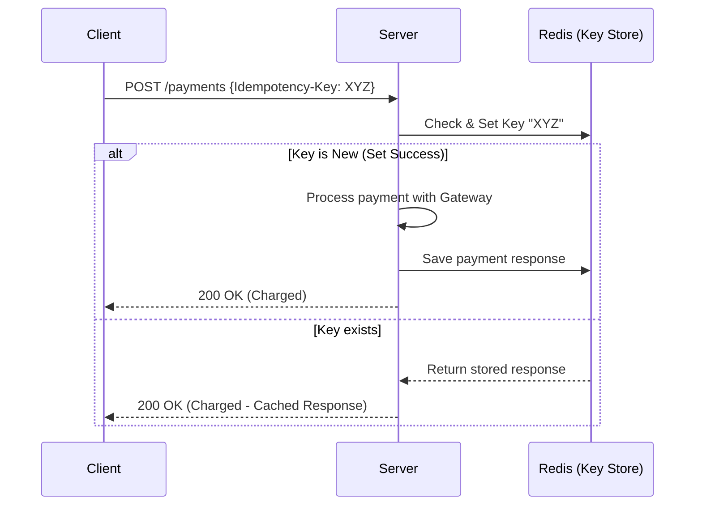
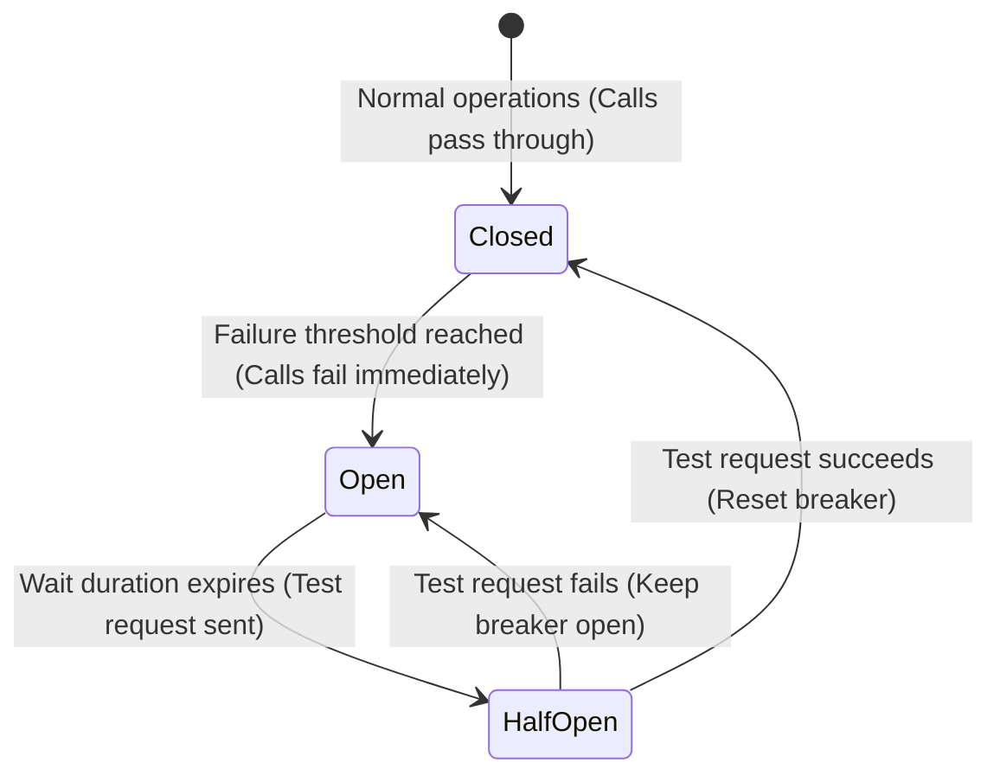

# 🛡️ Module 03: Reliability & APIs Basics

This module explores how microservices communicate safely, how to handle redundant actions gracefully, and the defensive architectural patterns required to keep a system resilient under heavy load or hardware failure.

---

## 🔌 1. API Architectural Styles

Modern web applications depend on clean communication protocols between services.

| API Style | Transport Protocol | Format | Key Characteristics | Ideal Use Case |
| :--- | :--- | :--- | :--- | :--- |
| **REST** | HTTP/1.1 | JSON / XML | Resource-oriented, standard HTTP verbs, stateless caching | General-purpose web APIs |
| **gRPC** | HTTP/2 | Protobuf (Binary) | Bi-directional streaming, high performance, strictly typed | Microservice-to-microservice internal RPCs |
| **GraphQL** | HTTP/1.1 | JSON | Client declares exactly what fields they need in a single request | Frontend clients aggregate data from multiple schemas |
| **WebSockets**| TCP | Binary / Text | Full-duplex persistent channel over a single connection | Live chat, real-time dashboards |

---

## 🔁 2. Idempotency

**Idempotency** guarantees that executing an operation multiple times produces the exact same result as executing it once. This is critical in distributed networks where retries are common.

> [!WARNING]
> **Example Scenario:** A client clicks "Pay Now" on an e-commerce site. The request times out due to a transient network issue. If the client retries the request and the operation is **not** idempotent, the customer might be charged twice!

### Implementing Idempotency with Keys
1.  The client generates a unique **Idempotency Key** (UUID) and sends it in the HTTP request header (`Idempotency-Key: f47ac10b-...`).
2.  The server attempts to save the key to a fast database (like Redis) with a transaction.
3.  If the key already exists, the server immediately returns the cached response of the initial request, bypassing the business logic (e.g., credit card billing).

---

## 🏛️ 3. Stateless vs. Stateful Services

To scale horizontally, engineers try to make application services stateless.

*   **Stateless Services:**
    *   Do not store client session state or history on the server's local disk or memory.
    *   Any request can be handled by any server instance.
    *   *Scale Action:* Simply spin up 10 more instances behind a load balancer!
*   **Stateful Services:**
    *   Keep local session data (e.g., active chat connection state, in-memory shopping carts).
    *   Requires routing the same client back to the *same* server (sticky sessions), complicating scaling and failover.

---

## 🚦 4. Rate Limiting

Rate Limiting protects resources from brute-force attacks, DDoS, and runaway API consumers by throttling the number of requests a client can make in a given timeframe.

### Common Algorithms
1.  **Token Bucket:** A bucket holds up to $N$ tokens, refilling at a constant rate. Each request consumes a token. If the bucket is empty, the request is dropped. (Allows short bursts of traffic).
2.  **Leaky Bucket:** Requests enter a queue and are processed at a steady, constant rate. If the queue overflows, requests are dropped. (Ensures a smooth, steady egress rate).
3.  **Sliding Window Log:** Stores timestamps of every request in Redis. The server counts the number of timestamps in the sliding window range (e.g., past 60 seconds) to determine if a request should be throttled. (Most accurate, but memory-intensive).

---

## 🩹 5. Reliability & Fault Tolerance Patterns

To prevent a failure in one service from cascading and bringing down the entire architecture, we implement resilient design patterns.

### The Circuit Breaker Pattern
Inspired by electrical circuit breakers, this pattern prevents an application from repeatedly executing an operation that is guaranteed to fail.

*   **Closed State:** Requests are routed to the downstream service. The breaker monitors failure rates.
*   **Open State:** Downstream service has failed. The breaker short-circuits and returns errors instantly without querying the broken service, saving resources and allowing it to recover.
*   **Half-Open State:** After a cooldown period, the breaker allows a small percentage of requests through to test the service's health.

### Retries with Exponential Backoff and Jitter
When a transient network error occurs, retrying immediately can overwhelm a recovering downstream service (thundering herd problem).
*   **Exponential Backoff:** Increase the wait time between retries exponentially (e.g., $1\text{s}$, $2\text{s}$, $4\text{s}$, $8\text{s}$).
*   **Jitter:** Add random variance (noise) to the wait time so multiple retrying client instances do not hit the server at the exact same millisecond.

---

### Next Module:
👉 [**Module 04: System Characteristics, Metrics, & Trade-offs**](./04_system_characteristics.md)
