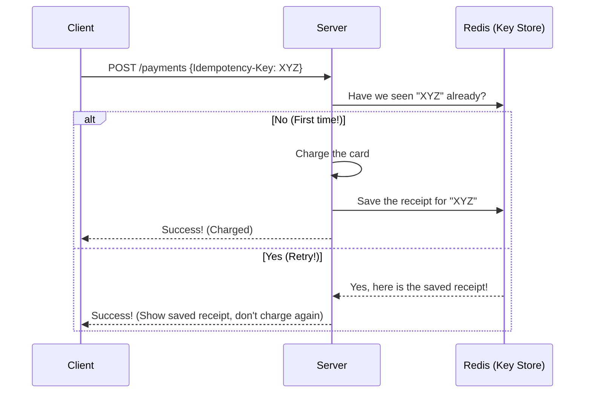
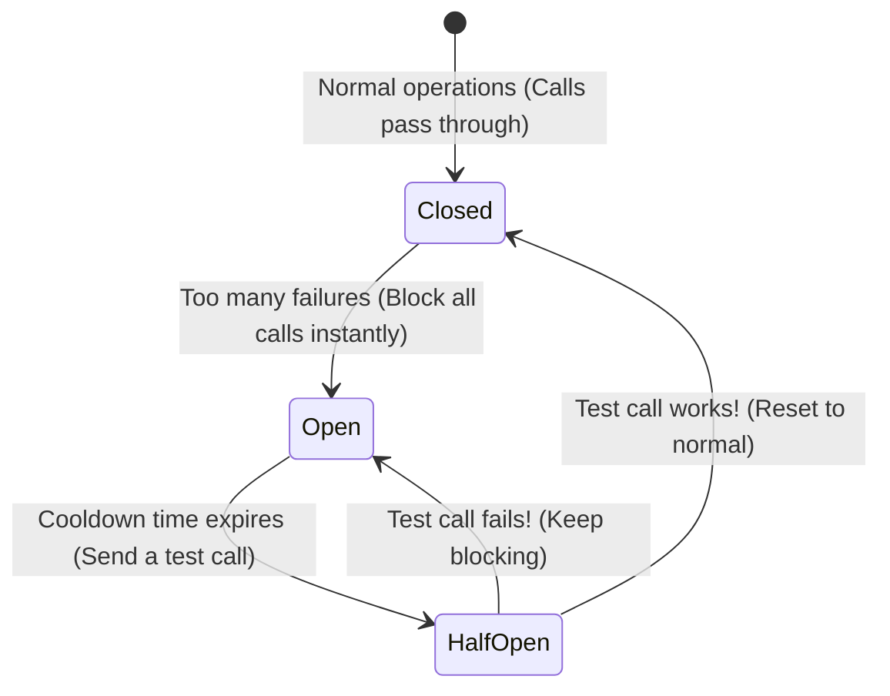

# 🛡️ Part 3: Reliability & APIs Basics

In this guide, we will learn how different parts of a system talk to each other safely, how to make sure we don't charge a customer twice by mistake, and how to stop one broken service from crashing the whole system.

---

## 🔌 1. API Styles (How Computers Talk)

An **API** is a set of rules that lets two applications talk to each other. Here are the most popular styles:

| Style | Transport | Format | Simple Explanation | Best Use Case |
| :--- | :--- | :--- | :--- | :--- |
| **REST** | HTTP/1.1 | JSON | Simple, standardized, and resource-based. Easy to use. | Most standard mobile and web apps. |
| **gRPC** | HTTP/2 | Binary | Super-fast binary communication. Great for speed. | Internal communication between backend servers. |
| **GraphQL**| HTTP/1.1 | JSON | The client asks for exactly what fields they want. | Frontend sites loading complex custom data. |
| **WebSockets**| TCP | Text/Binary| A two-way channel that stays open constantly. | Real-time chat apps and multiplayer games. |

---

## 🔁 2. Idempotency (Avoiding Double Actions)

**Idempotency** is a fancy word for a simple concept: *"No matter how many times you run an action, it should only happen once."*

> [!WARNING]
> **Why this matters:** Imagine a user buys a $50 shirt. They click "Buy" but the page freezes. They click "Buy" again. If your system isn't idempotent, they might get charged $100!

### How we fix this with "Idempotency Keys"
1.  The phone generates a unique random ID (like `key-12345`) for the payment.
2.  The server checks a fast cache (like Redis) to see if we have processed `key-12345` already.
3.  If it is new, we charge the card and save the result in the cache.
4.  If it is old, we skip the charge and just return the receipt we already saved!

---

## 🏛️ 3. Stateless vs. Stateful Services

To grow easily, your application servers should be **Stateless**.

*   **Stateless (Highly Scalable):** The server does not remember anything about who you are. Each request has to contain all the information needed to answer it. If one server crashes, any other server can take over instantly. You can easily add 100 servers in seconds!
*   **Stateful (Hard to Scale):** The server remembers your login session locally in its own memory. You must always talk to the *same* server, which makes load balancing and server crashes very difficult to handle.

---

## 🚦 4. Rate Limiting (The Door Bouncer)

A **Rate Limiter** is like a bouncer at a club. It limits how many requests a user can make in a minute. This stops bad actors or broken scripts from flooding your servers with requests and crashing your site.

### Common Bouncer Rules
*   **Token Bucket:** The bouncer gives you a bucket of 10 tokens. Every request costs 1 token. Tokens refill slowly over time. If your bucket is empty, you must wait. (Allows small bursts of speed).
*   **Leaky Bucket:** Requests are lined up in a queue and processed at a steady, slow pace. If the queue gets too full, requests are turned away. (Ensures a smooth, steady stream).

---

## 🩹 5. Resiliency (Stopping Cascading Crashes)

If one small service in your system breaks, you need to stop it from crashing the entire system.

### The Circuit Breaker Pattern
Just like the circuit breaker in your house that cuts power when there is an electrical spike, this pattern stops calls to a broken service:

*   **Closed State:** Everything is normal. Calls flow freely.
*   **Open State:** The downstream service is failing. The breaker trips, blocking all requests immediately. The user gets a quick, clean error message instead of waiting forever for a timed-out page.
*   **Half-Open State:** After a few minutes, the bouncer lets a single request through to test if the service has recovered. If it works, we go back to Closed. If it fails, we keep it Open.

---

### Next Module:
👉 [**Part 4: System Speed & Uptime**](./04_system_characteristics.md)
