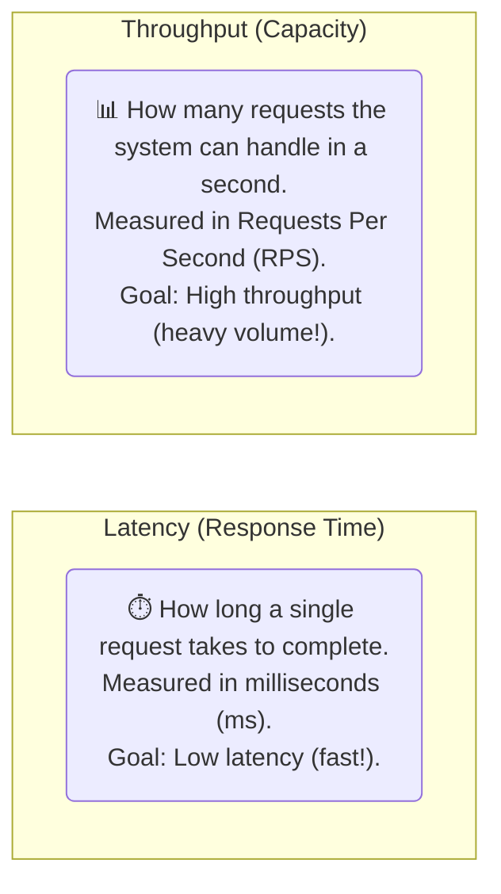
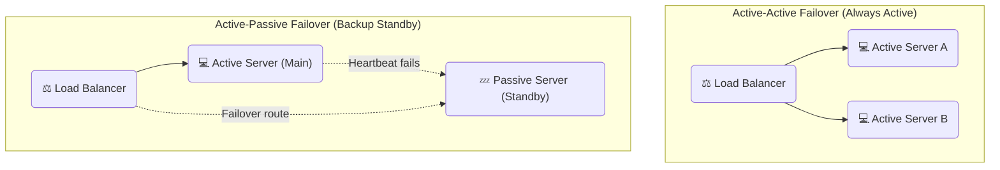
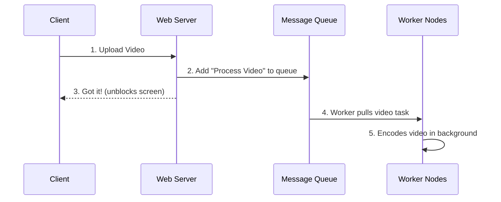
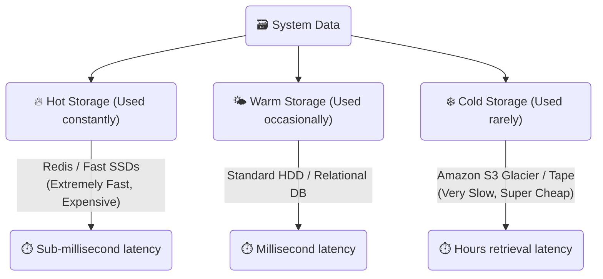

# ⚖️ Part 4: System Speed & Uptime

In this guide, we will learn about the key performance metrics of a system: how fast it is (latency), how much work it can do (throughput), how we keep it always on (availability), and how we store different kinds of data to save money.

---

## 🏎️ 1. Latency vs. Throughput (Speed vs. Volume)

When measuring how fast a system performs, we look at two main metrics:

### The Trade-off
*   **High Throughput, High Latency:** Like a large freight train. It carries a massive amount of cargo at once (high throughput), but it takes a long time to get from start to finish (high latency). E.g., background video processing.
*   **Low Latency, Low Throughput:** Like a high-speed sports car. It can only carry one passenger (low throughput) but it gets to the destination in seconds (low latency). E.g., online video game actions.

---

## 🏛️ 2. High Availability (Uptime)

**Availability** is the percentage of time your website is online and working properly. 

### The Uptime "Nines" Matrix

| Uptime % | How much it can be offline in a year | What it means |
| :--- | :--- | :--- |
| **99% ("Two Nines")** | 3.65 days | Standard personal website |
| **99.9% ("Three Nines")** | 8.77 hours | Basic business app |
| **99.99% ("Four Nines")** | 52.60 minutes | E-commerce checkout, Banking APIs |
| **99.999% ("Five Nines")** | 5.26 minutes | Telecommunications, Cloud Infrastructure |

### How to Keep Your System Online
1.  **Redundancy (Backups):** Never have just one server. Have active backups!
    *   **Active-Active:** Both servers run at the same time, splitting the work. If one dies, the other takes over 100% of the traffic without anyone noticing.
    *   **Active-Passive:** Server A does all the work while Server B sits asleep. If Server A fails, Server B is quickly woken up to take over.
2.  **Heartbeats:** Servers send periodic "Are you alive?" ping signals to each other. If a server stops pinging, we automatically route traffic away from it.

---

## 📊 3. High Throughput (Asynchronous Messaging)

If your app has to do a heavy task (like sending a verification email or resizing a photo), do not make the user wait on the screen. Instead, use **Asynchronous Processing**:

1.  The user clicks "Submit."
2.  The web server drops the task into a **Message Queue** (like Kafka or RabbitMQ) and says "We got it, check back later!" to the user instantly.
3.  Background workers pull tasks from the queue and process them slowly in the background, keeping your website extremely fast and unblocked!

---

## ⚡ 4. Low Latency (Tools for Speed)

*   **CDNs (Content Delivery Networks):** Giant networks of cache servers spread across the globe. They keep copies of static files (images, CSS, videos) close to users physical location so files load instantly.
*   **HTTP/3 & QUIC:** Newer internet connection rules that use UDP, eliminating network delays and speeding up connection handshake times.

---

## ❄️ 5. Hot vs. Cold Storage (Saving Money)

Storing data in fast RAM is expensive. Storing it on slow hard drives is cheap. We organize data into "Temperature" tiers based on how often we need to look at it:

*   **Hot Data:** Active user sessions, trending feeds. We keep this in super fast RAM (Redis) or SSDs.
*   **Cold Data:** 3-year-old receipt history, database backups, logs. We keep this in super cheap offline vaults like Amazon S3 Glacier. It might take hours to load, but it costs almost nothing to store.

---

### Next Module:
👉 [**Part 5: Cloud Services Comparison Chart**](./05_cloud_comparison.md)
