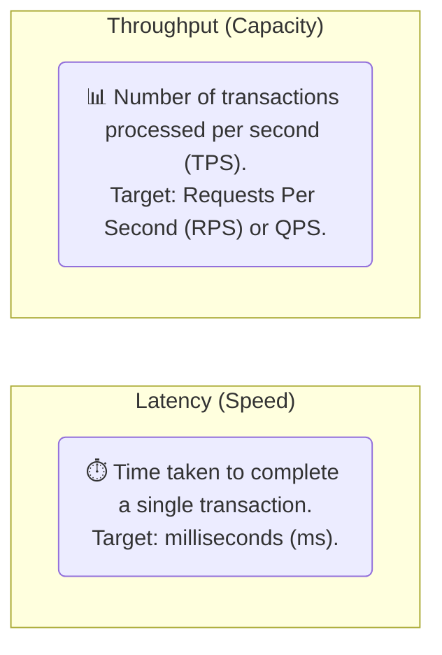
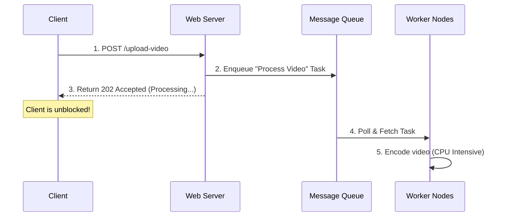
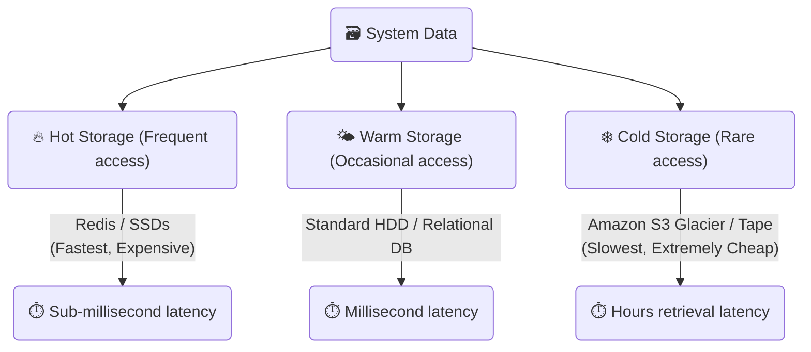

# ⚖️ Module 04: System Characteristics & Performance Metrics

This module details the key performance goals, measurements, and trade-offs that system architects balance to achieve High Availability (HA), High Throughput, and Low Latency.

---

## 🏎️ 1. Latency vs. Throughput

Engineers must optimize code and infrastructure depending on the primary performance goal of the system.

### The Trade-off
*   **High Throughput, High Latency:** E.g., batch processing bills or video encoding. You process millions of records at once (high throughput), but each individual job takes minutes (high latency).
*   **Low Latency, Low Throughput:** E.g., a real-time gaming server or high-frequency trading desk. Transactions must occur in sub-milliseconds (low latency), but the server cannot process large concurrent batches of queries (low throughput) without increasing delay.

---

## 🏛️ 2. High Availability (HA)

**Availability** measures the percentage of time a system is fully operational and accessible.

### The "Nines" of Availability

| Availability % | Downtime per Year | Downtime per Month | Target Level |
| :--- | :--- | :--- | :--- |
| **99% ("Two Nines")** | 3.65 days | 7.30 hours | Basic website |
| **99.9% ("Three Nines")** | 8.77 hours | 43.83 minutes | standard SaaS platform |
| **99.99% ("Four Nines")** | 52.60 minutes | 4.38 minutes | E-commerce checkout, Banking APIs |
| **99.999% ("Five Nines")** | 5.26 minutes | 26.30 seconds | Telecommunications, cloud infrastructure |

### Key High Availability Strategies
1.  **Redundancy & Failover:**
    *   **Active-Active:** Multiple active nodes handle traffic simultaneously. If one fails, the load balancer redistributes traffic to the surviving active nodes.
    *   **Active-Passive:** A secondary "passive" backup node sits idle. If the "active" node fails, traffic is redirected (failed over) to the passive node.
2.  **Heartbeats:** Periodic signal packets sent between nodes to monitor node health and trigger automatic failovers when a node becomes unresponsive.
3.  **GeoDNS & Global Failovers:** Routing users to different physical data centers globally based on their location or proximity. If an entire AWS region goes offline, GeoDNS automatically re-routes traffic to the nearest healthy region.

---

## 📊 3. High Throughput

To scale throughput to handle hundreds of thousands of concurrent requests, systems avoid synchronous blockers.

### Asynchronous Processing & Message Queues
Instead of processing long-running operations during the user's request-response lifecycle, applications dump tasks into a **Message Queue** (e.g., Kafka, RabbitMQ) and respond to the user immediately. Background workers pull tasks from the queue asynchronously.

---

## ⚡ 4. Low Latency

Optimizations that minimize the time packets spend traveling or waiting:

1.  **Content Delivery Networks (CDNs):** Distributed networks of servers that cache static assets (images, JS, CSS, video files) at the "edge" of the internet, serving them from physical locations closest to the user.
2.  **Edge Computing:** Running light serverless functions directly on CDN edge servers (e.g., Cloudflare Workers) to process requests without routing them back to the origin database.
3.  **HTTP/3 & QUIC:** Utilizes UDP instead of TCP to eliminate Head-of-Line blocking and drastically decrease connection handshake times.
4.  **Multiplexing & Keep-Alive:** Reusing standard TCP connections for multiple HTTP requests rather than establishing a new connection handshake every time.

---

## ❄️ 5. Hot vs. Cold Storage (Tiered Storage)

To optimize cost while maintaining low latency, architects separate data based on access frequency.

*   **Hot Data:** User profiles, active sessions, trending feeds. Stored in RAM (Redis) or high-speed NVMe SSDs.
*   **Cold Data:** Logs from 3 years ago, transactional receipts, system backups. Stored in high-latency, extremely low-cost cloud vaults like Amazon S3 Glacier.

---

### Next Module:
👉 [**Module 05: The System Design Interview Blueprint**](./05_interview_steps.md)
