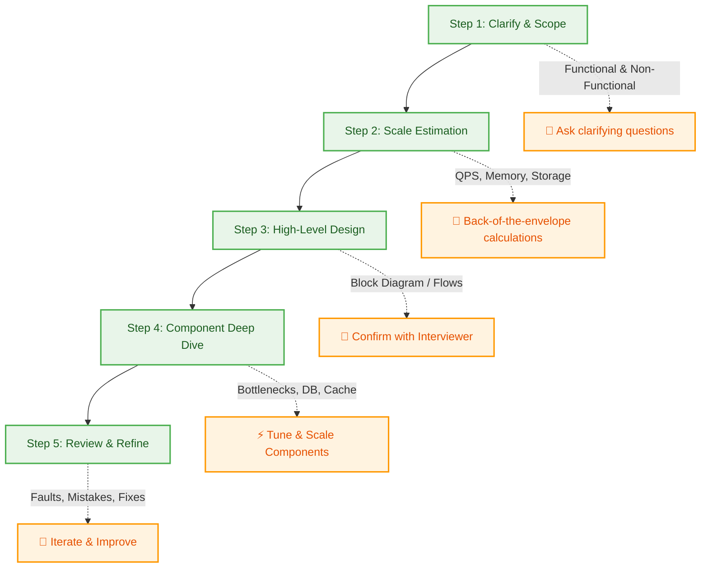

# 🎯 Module 05: The System Design Interview Blueprint

This module provides a step-by-step, highly interactive playbook to guide you through a System Design interview. It outlines how to frame the problem, communicate with the interviewer, and iteratively design a robust, production-grade system.

---

## 🗺️ The Step-by-Step Interview Roadmap

A successful system design interview is not a monologue; it is an active, structured collaboration between you and the interviewer. Follow these five core phases to navigate the interview seamlessly:



---

## 🔍 Step 1: Clarify Requirements & Scope

Never start designing immediately. Spend the first 3–5 minutes asking clarifying questions to establish the system boundaries.

### A. Functional Requirements (What it does)
Identify the exact core features the system must support.
*   *Example questions:* 
    *   "Can users post content, or just view it?"
    *   "Do we need to support search?"
    *   "Are we building a feed timeline?"
*   *Action:* Agree on the **top 2-3 functional features** to focus on.

### B. Non-Functional Requirements (Constraints & Qualities)
Determine the scale, reliability, and runtime expectations.
*   **Scale:** Daily Active Users (DAU), Monthly Active Users (MAU).
*   **Availability:** Is 99.9% uptime sufficient, or does it require 99.999% (e.g., payment system)?
*   **Latency:** Does this require real-time execution (< 100ms) or is asynchronous processing acceptable?
*   **Consistency:** Strong consistency vs. eventual consistency (refer to the [CAP/PACELC Theorems](./02_databases_caching.md)).

---

## 🧮 Step 2: Back-of-the-Envelope Scale Calculations

Quantify the scale of your system. This informs your choice of database, network protocol, caching tiers, and partitioning keys.

*   **Write QPS:** How many writes/seconds are coming in? (e.g., $10\text{ Million users} \times 1\text{ write/day} \approx 115\text{ write QPS}$).
*   **Read QPS:** What is the read-to-write ratio? (e.g., standard social apps have a $100:1$ read-to-write ratio).
*   **Storage Capacity:** How much disk space will we consume over 5 years? (e.g., $1.15\text{ KB/write} \times 10\text{ Million writes/day} \approx 11.5\text{ GB/day} \approx 4.2\text{ TB/year}$).
*   **Memory / Cache capacity:** Assume caching **20%** of daily read traffic (Pareto Principle / 80-20 rule) to determine Redis memory sizing.

---

## 🧱 Step 3: High-Level Design & Core Architecture

Draw a clean block diagram representing the end-to-end flow of the request.

```
[User Client] ➔ [Load Balancer] ➔ [API Gateway] ➔ [Application Service] ➔ [Database]
                                                       ➔ [Cache (Redis)]
```

> [!IMPORTANT]
> **Interact & Confirm with Interviewer:** Before detailing any single component, stop and say:
> *"This is the high-level flow of our web request. Does this layout align with your expectations, or should I expand on a specific component like the API Gateway or database structure first?"*
> This ensures you do not waste time designing a part the interviewer doesn't care about.

---

## ⚡ Step 4: Component Deep Dive

Once the interviewer approves the high-level roadmap, drill down into performance, scaling bottlenecks, and structural details:

*   **Database Schema Design:** Define tables, relationships, primary keys, and index selections.
*   **Scaling the Data Layer:** Propose read replicas, caching tiers, and a partitioning/sharding strategy (e.g., sharding by `user_id`).
*   **API Design:** Define the endpoints, methods (GET/POST), and payload structures (JSON/Protobuf).
*   **Reliability:** Address rate-limiting strategies and circuit breakers to prevent cascades of failures (see [Module 03](./03_reliability_apis.md)).

---

## 🔄 Step 5: Review, Identify Mistakes, & Refine

No design is perfect. Interviewers want to see how you analyze bottlenecks, address mistakes, and refine your system under pressure.

### How to Handle Mistakes & Constraints
*   **Acknowledge & Adapt:** If the interviewer points out a flaw (e.g., *"What happens if a shard key creates a 'hot spot' where one server gets 99% of the traffic?"*):
    *   Do not get defensive.
    *   Acknowledge the mistake: *"That is an excellent point. Sharding purely by `user_id` will cause a hotspot for extremely active celebrity accounts."*
    *   Propose a fix: *"To solve this, we can append a random hash suffix to the shard key for high-volume accounts to distribute the load across multiple shards."*
*   **Design for Failure:** Identify single points of failure (SPOF) and explain how replication, geographic redundancy, and failover health checks mitigate them.
*   **Trade-off Summary:** Briefly explain the structural trade-offs of your choices (e.g., *"We chose eventual consistency to optimize write availability and throughput, which means users might see a slight delay in updates."*).

---

👉 [**Back to Home ➔**](./README.md)
