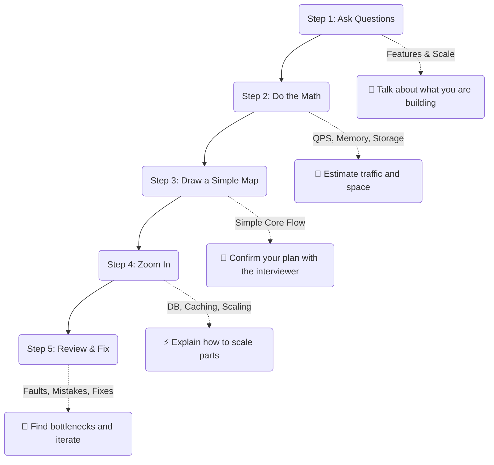
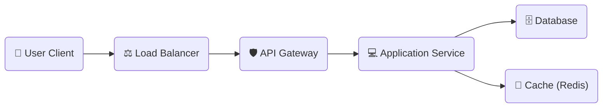

# 🎯 Part 5: The System Design Interview Blueprint

In this guide, we will look at how to tackle a System Design interview. It is a step-by-step roadmap that shows you how to organize your thoughts, talk to your interviewer, draw your diagrams, and fix mistakes on the fly!

---

## 🗺️ The Step-by-Step Interview Roadmap

A system design interview is not a test where you sit in silence. It is a friendly conversation where you work together with the interviewer. Follow these five simple steps:

---

## 🔍 Step 1: Ask Questions & Scope the System

Never start drawing or coding immediately! Spend the first 3 to 5 minutes asking clarifying questions to find out exactly what the interviewer wants.

### A. What does it do? (Functional Scope)
Find out the main 2 or 3 features you need to design.
*   *Ask questions like:*
    *   "Can users post videos, or just text?"
    *   "Do we need a search bar?"
    *   "Are we building a feed like Twitter?"
*   *Action:* Pick the **top 3 features** and focus only on them.

### B. How big is it? (Non-Functional Scope)
*   **Scale:** How many people use the app? (Daily Active Users).
*   **Availability:** Does it need to be online 99.999% of the time, or is 99.9% fine?
*   **Speed:** Does it need to respond in milliseconds (like a chat app) or can tasks happen in the background?
*   **Consistency:** Do all users need to see the exact same data instantly (like banking), or is eventual consistency fine (like social media)?

---

## 🧮 Step 2: Do the Math (Scale Estimations)

Do some quick, high-level math to estimate how much traffic your servers will receive and how much storage space you will need.

*   **Write Requests (QPS):** How many times a second are users uploading or writing data? (e.g., $10\text{ Million users} \times 1\text{ write/day} \approx 115\text{ requests every second}$).
*   **Read Requests (QPS):** How many times are they looking at data? (e.g., standard social apps have 100 times more reads than writes).
*   **Storage Space:** How much disk space will you use over 5 years? (e.g., $1\text{ KB/write} \times 10\text{ Million writes/day} \approx 10\text{ Gigabytes/day} \approx 3.6\text{ Terabytes/year}$).
*   **Cache RAM Size:** Plan to store the most popular **20%** of daily reads in memory (Redis) to keep the system fast.

---

## 🧱 Step 3: Draw a Simple Map (High-Level Design)

Draw a simple, clean diagram showing how a user request flows from the client to the server and database. Keep it horizontal (Left-to-Right) and extremely clean!

> [!IMPORTANT]
> **Check in with your interviewer!** Stop here, look at the interviewer, and say:
> *"This is the basic flow of a request. Does this map make sense, or is there a specific part you want me to zoom into next?"*
> This keeps them involved and ensures you don't go down the wrong path.

---

## ⚡ Step 4: Zoom In (Component Deep Dive)

Once the interviewer approves your simple map, you can go into details:

*   **Database Schema:** Write down what tables you will need and what fields go inside them.
*   **Scaling Databases:** Propose read replicas to handle heavy read volumes, or sharding keys to split the database across multiple servers.
*   **API Design:** Define the endpoint paths (like `POST /v1/tweets`) and what the data looks like.
*   **Reliability:** Add rate limiters to block bad traffic and circuit breakers to stop system-wide crashes (see [Part 3](./03_reliability_apis.md)).

---

## 🔄 Step 5: Review, Find Mistakes, & Improve

No system design is perfect. Interviewers want to see how you analyze mistakes, handle failure, and improve your own designs under pressure.

### How to handle mistakes gracefully
*   **Acknowledge and Adapt:** If the interviewer spots a problem (e.g., *"What if Server 2 gets overloaded because all popular celebrity accounts are stored on it?"*):
    *   Do not get defensive.
    *   Acknowledge the mistake: *"That is a great point. Sharding purely by username will cause Server 2 to get overloaded by celebrity traffic."*
    *   Propose a fix: *"To solve this, we can add a random number to the end of the celebrity shard keys to spread their data across multiple servers."*
*   **Design for Failure:** Explain what happens if a server dies. Show how your backups (redundancy) and health checks keep the system running.
*   **Summarize Trade-offs:** Explain the pros and cons of your choices (e.g., *"We chose a NoSQL database because it is very easy to scale, but that means users might see slightly delayed updates for a few seconds."*).

---

👉 [**Back to Home ➔**](./README.md)
