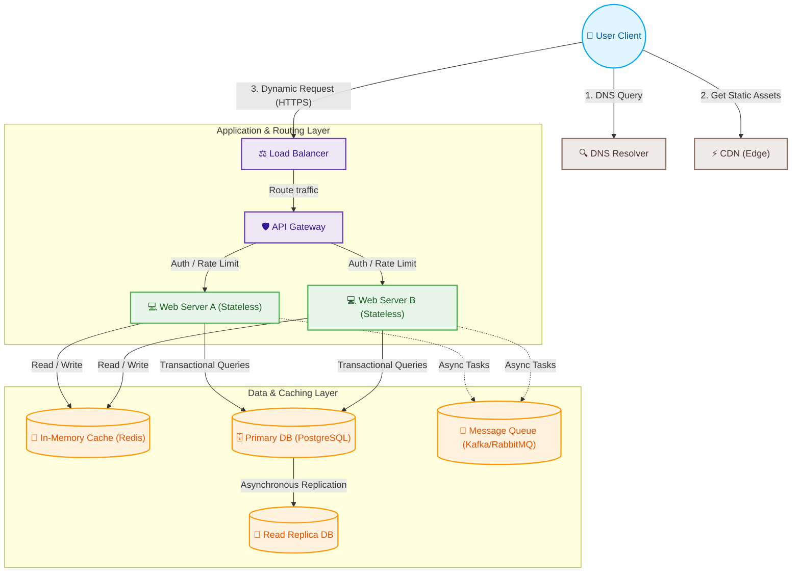

# 🌐 System Design Basics: Core Fundamentals & Patterns

Welcome to the **System Design Basics** showcase! This guide is curated to help engineers, architects, and designers master the building blocks of highly scalable, reliable, and performant distributed systems.

Whether you are preparing for system design interviews, reviewing architectural concepts, or looking for real-world design blueprints, this showcase provides clean, visual, and easy-to-digest deep dives into every fundamental topic.

---

## 🗺️ High-Level System Architecture Roadmap

Before diving into individual terms, let's look at how these fundamental building blocks connect in a modern, production-ready system:

---

## 🗂️ Interactive Index & Learning Pathway

The concepts are grouped into 4 logical modules designed to build upon each other:

| Module | Core Topics | Key Takeaways | Link |
| :--- | :--- | :--- | :--- |
| **01. Scalability & Network** | Scaling, Load Balancers, Protocols | Vertical vs. Horizontal, DNS, L4 vs. L7 LB, TCP vs. UDP | [Explore Module 01 ➔](./01_scalability_network.md) |
| **02. Databases & Caching** | CAP/PACELC, SQL/NoSQL, Caching | Strong vs. Eventual Consistency, Cache-Aside, Replication | [Explore Module 02 ➔](./02_databases_caching.md) |
| **03. Reliability & APIs** | API Styles, Idempotency, Patterns | REST vs. gRPC, Rate Limiting, Circuit Breakers | [Explore Module 03 ➔](./03_reliability_apis.md) |
| **04. System Characteristics** | HA, Throughput, Low Latency | SLA/SLOs, Message Queues, Keep-Alive, Hot/Cold Storage | [Explore Module 04 ➔](./04_system_characteristics.md) |
| **05. Interview Blueprint** | Clarifying, Estimating, Refinement | Ask Clarifying Questions, Back-of-the-envelope, Fix Mistakes | [Explore Module 05 ➔](./05_interview_steps.md) |

---

## 🎯 How to Consume this Showcase

1. **Systematic Learning:** Follow modules `01` through `04` sequentially to build a solid foundation.
2. **Visual Learning:** Study the **Mermaid diagrams** included in each section to understand exactly how packets, data, and requests flow.
3. **Reference Sheet:** Use the markdown files as quick search references for terms during engineering design reviews or mock interviews.
