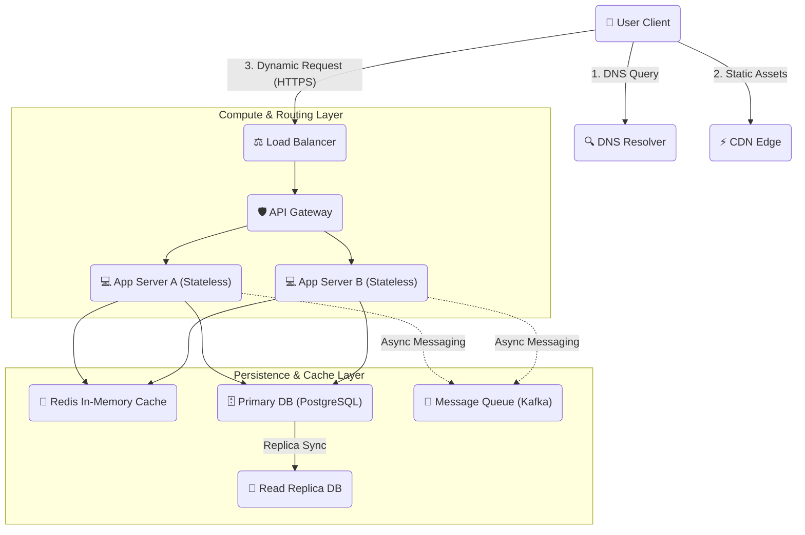

# 🌐 System Design Basics: Simple Guides for Everyone

Welcome to the **System Design Basics** guide! We made this folder to explain how big websites and apps work under the hood. 

If you are getting ready for a job interview, learning how to code, or just curious about how systems like Netflix or YouTube handle millions of users, you are in the right place! We use simple words, everyday examples, and clear pictures to make these ideas easy to understand.

---

## 🗺️ How a Big Website Works (A Simple Map)

Before we look at the terms, let's look at the path a request takes when you open a website on your phone:

---

## 🗂️ What You Will Learn

We broke this guide down into 7 easy parts:

| Part | What it is about | Why it matters | Link |
| :--- | :--- | :--- | :--- |
| **01. Scaling & Networks** | How to grow your website and send data. | Helps you handle more traffic without crashing. | [Read Part 1 ➔](./01_scalability_network.md) |
| **02. Databases & Caching** | How we save information and make it fast. | Keeps your data safe and stops things from being slow. | [Read Part 2 ➔](./02_databases_caching.md) |
| **03. Reliability & APIs** | How computers talk and handle errors. | Keeps your app working even when parts of it break. | [Read Part 3 ➔](./03_reliability_apis.md) |
| **04. System Speed & Uptime** | How to keep your system fast and always on. | Makes sure users have a great, snappy experience. | [Read Part 4 ➔](./04_system_characteristics.md) |
| **05. Cloud Comparison** | Comparing services across AWS, GCP, and Azure. | Helps you map terms to real-world cloud tools. | [Read Part 5 ➔](./05_cloud_comparison.md) |
| **06. Interview Playbook** | How to ace your system design interview. | A simple, step-by-step plan to impress interviewers. | [Read Part 6 ➔](./06_interview_steps.md) |
| **07. URL Shortener** | A complete, end-to-end system design case study. | Puts all concepts together with real estimations and diagrams. | [Read Part 7 ➔](../Questions_and_Answers/URL_Shortner/URL_Shortner.md) |

---

## 🎯 How to Use This Guide

1.  **Read in order:** If you are new, start with Part 1 and go through to Part 7.
2.  **Look at the pictures:** We included simple diagrams to show you exactly how data flows.
3.  **Use it as a cheat sheet:** Keep this open when you are studying or working on a project to quickly look up terms!
